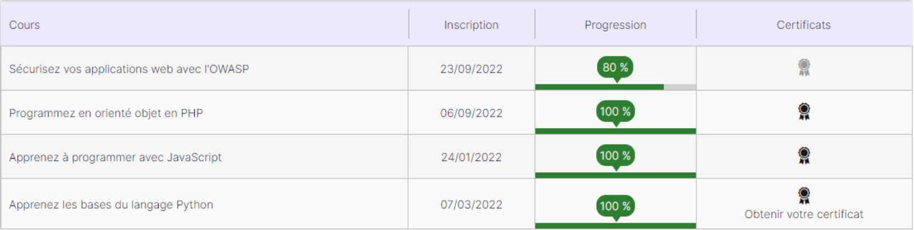
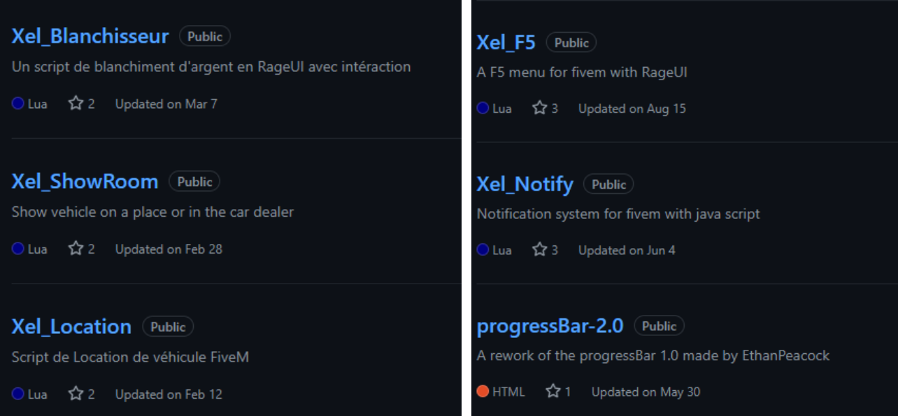
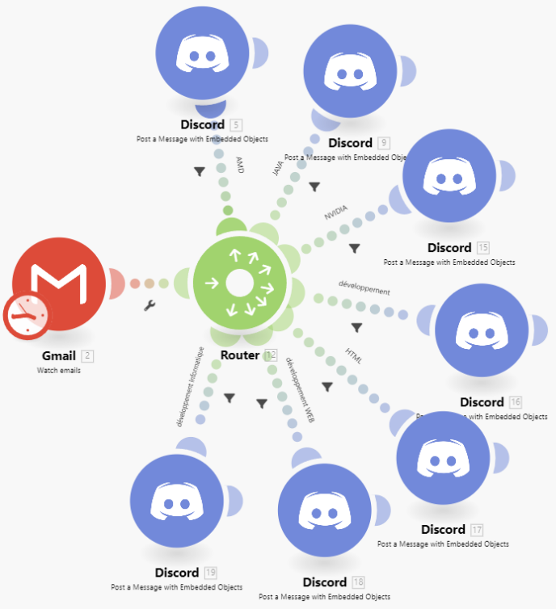
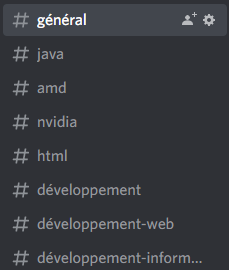
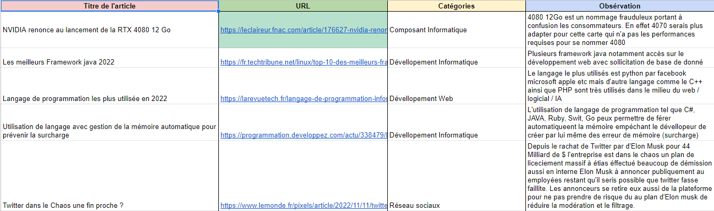

# Compétence SIO [A 1.6]

##  Organisation de son développement professionnel

### Apprentissage personnel

**OpenClassroom :** Afin de développer mes connaissances personnelles j’ai suivi plusieurs cours via le site OpenClassroom proposant des formations gratuites ou payantes sur divers sujets j’ai personnellement suivi des formations gratuites sur le développement web.

Voici une capture d’écran des formations que j’ai pu réaliser sur OpenClassroom.

**Apprentissage Autonome :** Afin de pouvoir créer des serveurs de jeux FiveM j’ai appris de manière autodidacte le langage LUA avec la documentation officielle de leur site ainsi que des scripts proposés par des personnes sur GitHub. Pour aller plus loin et atteindre mon objectif j’ai aussi dû me familiariser avec les natives proposées par FiveM ainsi que la framework que j’utilise ESX. Avec du temps et de la persévérance j’ai appris à utiliser le LUA convenablement et je suis aujourd’hui capable de réaliser toute sorte de script que je propose gratuitement sur mon GitHub pour les autres utilisateurs de la communauté.

- Source LUA : <https://www.lua.org/pil/1.html>

- Source FiveM Natives : https://docs.fivem.net/natives/

- Source ESX Docs : <https://docs.esx-framework.org/legacy/installation/>

- Mes créations : https://github.com/Xeltax?tab=repositories

Voici un exemple des créations que je propose :

### Veille Informatique

Pour réaliser ma veille informatique j’utilise plusieurs outils dans un premier temps google Alerts avec des sujets liés au développement informatique (HTML, PHP, C#, Développement Web, Développement Informatique, JAVA, SQL …) puis j’utilise le site Make.com qui me permet de faire un lien automatique entre mes mails de veille et un serveur discord créé à l’occasion. Le but de cette démarche est d'avoir tous les jours à 9h (programmer par mes soins) les informations de veille qui arrivent sur mon serveur discord pour une plus grande facilité de visibilité. 

Voici à quoi ressemble le scénario sur Make.com :

Les mails sont récupérés puis triés selon leur intitulé pour être ensuite redirigés vers le salon de mon serveur discord de manière automatisé et organisé.

Grâce à cela je peux avoir un premier tri de mes articles de veille, ensuite je fais mon choix des articles les plus pertinents pour moi, puis je l’ai mis dans un tableau excel pour une organisation optimale.

### Gestion de son identité professionnelle

**Mon identité anonyme :** En tant que créateur de contenu pour FiveM comme dit précédemment j’utilise le pseudonyme Xeltax. Cela permet de rester anonyme auprès des utilisateurs. Pour développer mon identité professionnelle j’utilise principalement mon github ainsi que mon site Web : <https://xeltax.github.io>.

Cela permet aux gens de me connaître sans avoir connaissance de ma réelle identité.

**Ma réelle identité :** Afin de développer ma réelle identité professionnelle j’utilise Linkedin.

Je suis actuellement en train de constituer mon réseau avant de commencer à poster différents post pour l'agrandir encore plus et potentiellement me faire repérer par des entreprises interessé par mon profils.

Lien de mon Linkedin : [https://www.linkedin.com/in/clément-honoré-7166aa238/](https://www.linkedin.com/in/cl%C3%A9ment-honor%C3%A9-7166aa238/)

### Développement de son projet professionnel

Pour développer mon projet professionnel je compte m’inscrire sur la plateforme Fiverr qui  met en relation utilisateurs et créateurs dans tout domaine (Musique, Dessin, Animation, Développement …). Cette plateforme pourra me permettre d’avoir des contrats avec des particuliers afin de développer des sites Web / Applications contre une rémunération. Ce qui me permettra de constamment m’améliorer dans ma manière de coder, l’approche des projets ainsi que la gestion d’une relation clients et de support.

