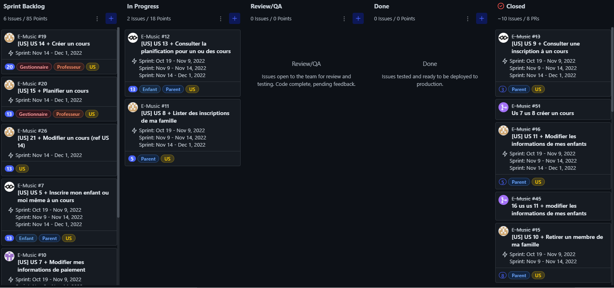
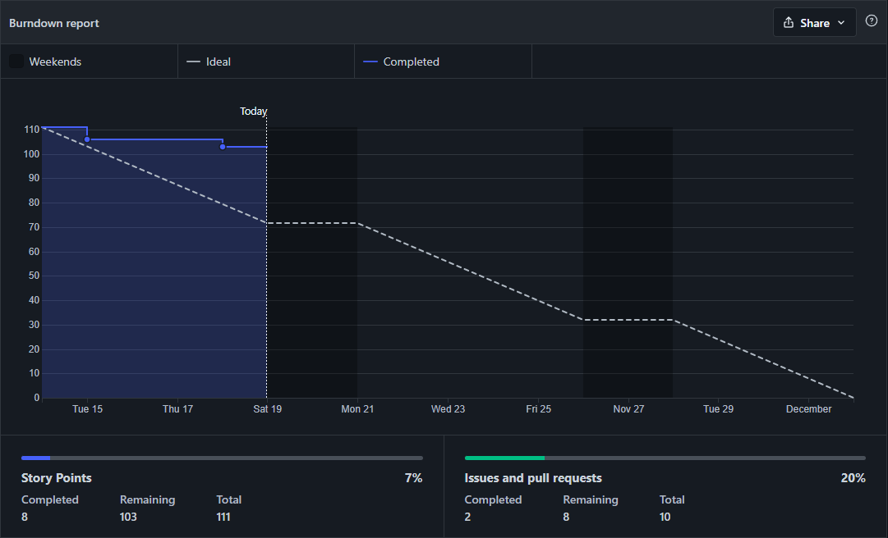

# Compétence SIO [A 1.4]

## Travail en mode Projet

Projet E-Music

Le projet E-Music consiste à réaliser une application pour l’école de musique municipale de IFS pour ce faire nous avons utilisé la méthode SCRUM afin d'appréhender au mieux ce projet.

**1.1 )** Analyse des objectifs et des modalités d’organisation d’un projet

Pour ce faire nous avons respecté plusieurs normes de la méthode SCRUM :

- Définir des User Story comportant plusieurs chose : en tant que “qui je réaliserai l’action”, je peux réaliser “l’action en question”, afin de “bénéfice de cette action”

- Attribuer des points d’histoire à chaque User Story ( en fonction de leur impotence / niveau de difficulté).

- Utiliser un gestionnaire adapter à cette méthode ici Zenhub qui nous permet de voir l’avancement du projet et de programmer des “Sprints” pour organiser la réalisation des tâches dans le temps.

**1.2 )** Planification des activités

En plus de Zenhub pour planifier le projet un tableau réel à été mit en place avec des post it contenant chaque User Story cette méthode est très similaire que Zenhub mais permet une meilleur interaction de par le fait que tout doit être fait manuellement.

**1.3 )** Évaluation des indicateurs de suivi d’un projet et analyse des écarts

De même que la planification Zenhub nous permet de voir les statistiques d’avancement et d’écart si il y en a.

Le graphique nous permet de voir l’avancement des User Story de notre Sprint mais aussi l’écart entre ce que l’on fait et les attendus.