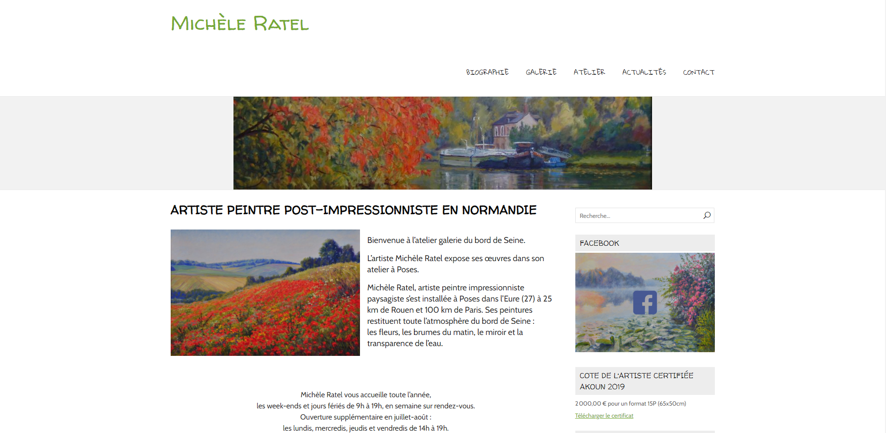

# [A 1.3] Développement de la présence en ligne de l’organisation

---
## Participation à l’évolution d’un site Web exploitant les données de l’organisation

---
### Refonte Site Artiste

J'ai, en première année de BTS SIO, amélioré le site de Michèle Ratel 
sous **WordPress**, en utilisant comme thème : **NatureSpace** 
et comme plugins : **WPForms Lite** et **Envira Gallery**.

### Stage Chez Altilog

J'ai, lors de mon stage chez Altilog, 
participé à l'évolution du site d'un client.
J'ai modifié l'apparence visuelle de certains boutons de l'interface et
j'ai modifié le z-index d'une image qui affiche un loading.
Pour des raisons de confidentialité, je n'ai pas d'image.